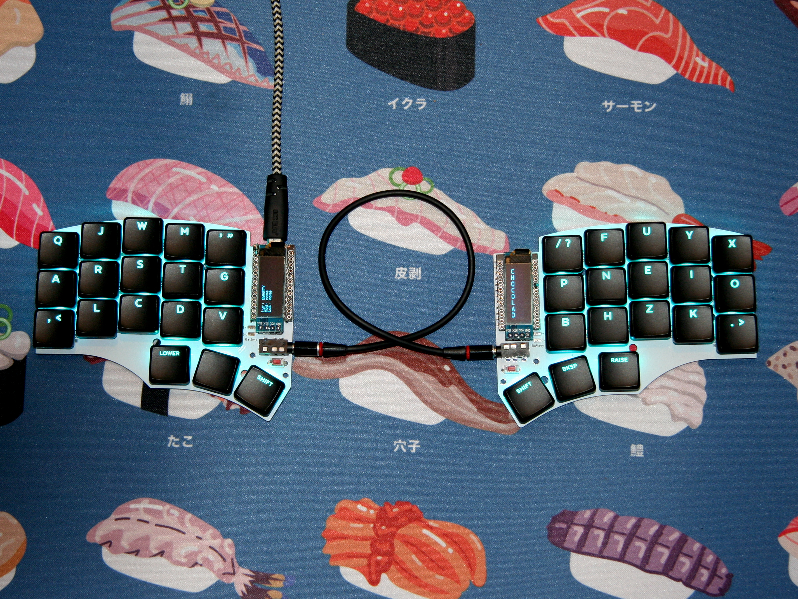
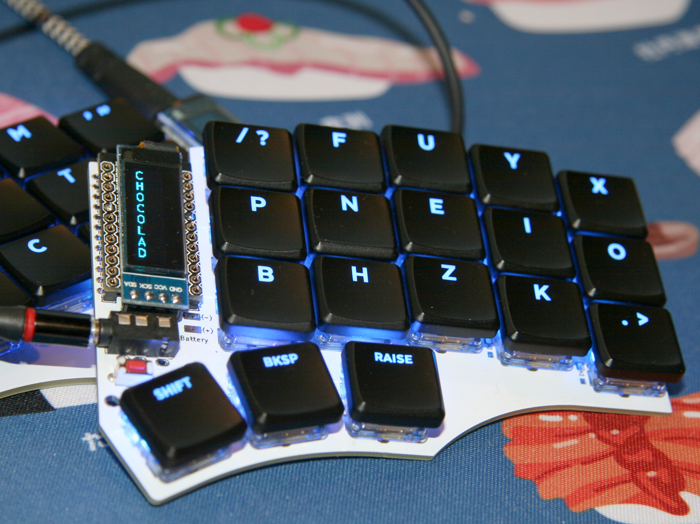
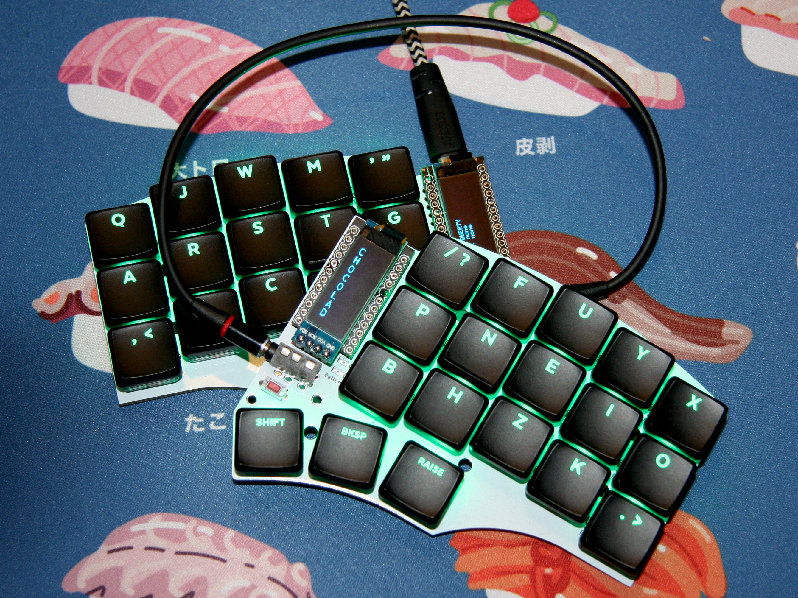
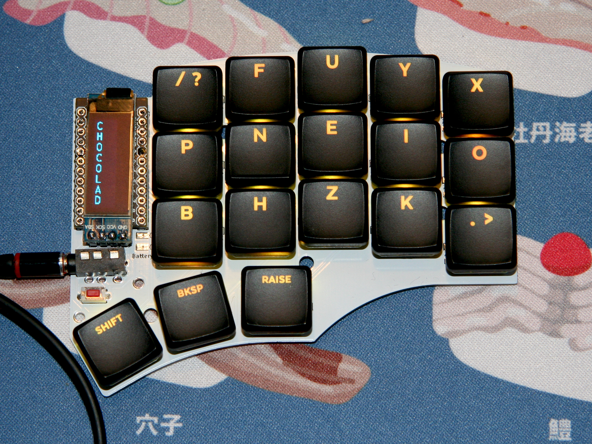
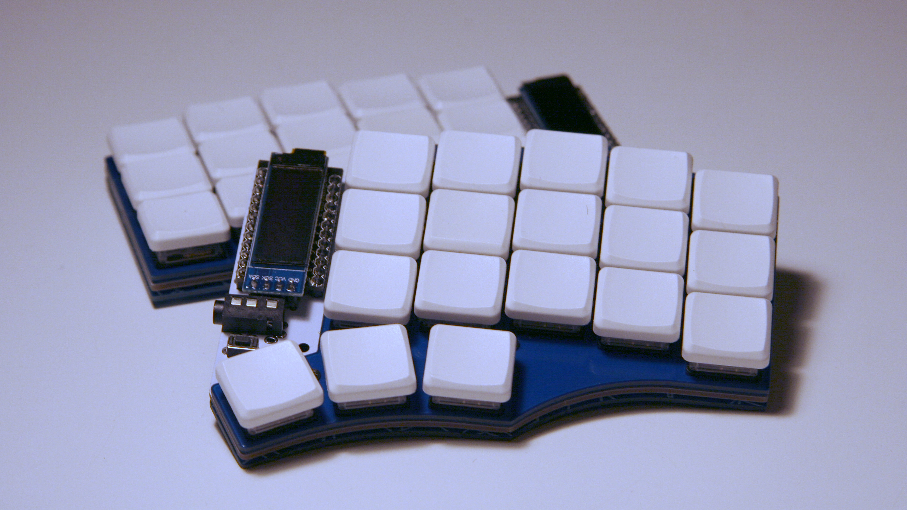
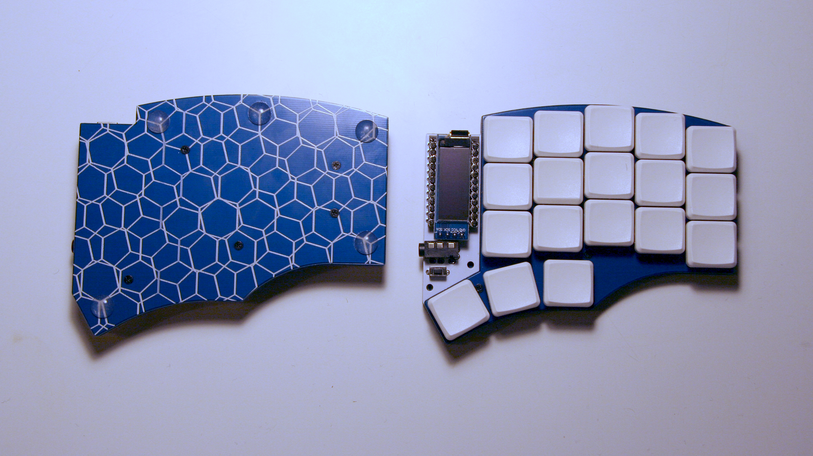
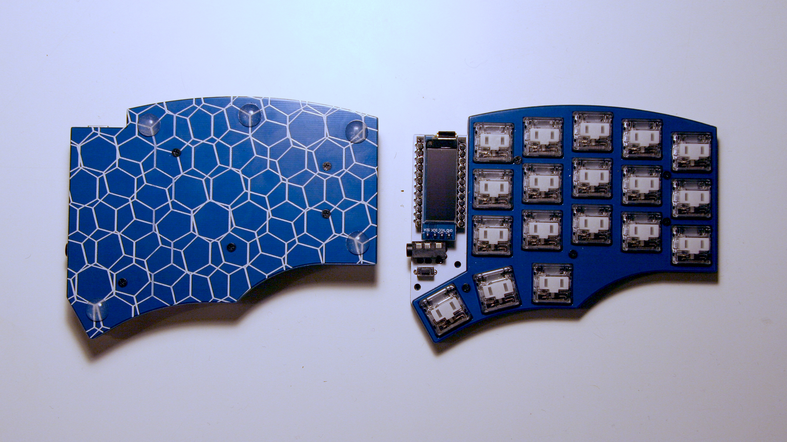

# The Chocolad, now in RGB

The chocolad is a 3x5+3 split column stagger keyboard based on the [Corne Chocolate](https://github.com/foostan/crkbd/blob/master/corne-chocolate/doc/buildguide_en.md) and the [chocorne](https://github.com/davidphilipbarr/36keys/tree/master/42Keys/chocorne). It is compatible with Kailh choc v1 switches and uses the 18x17mm spacing best suited to MBK keycaps. The name and shape are inspired by the [DracuLad](https://github.com/MangoIV/dracuLad/).

