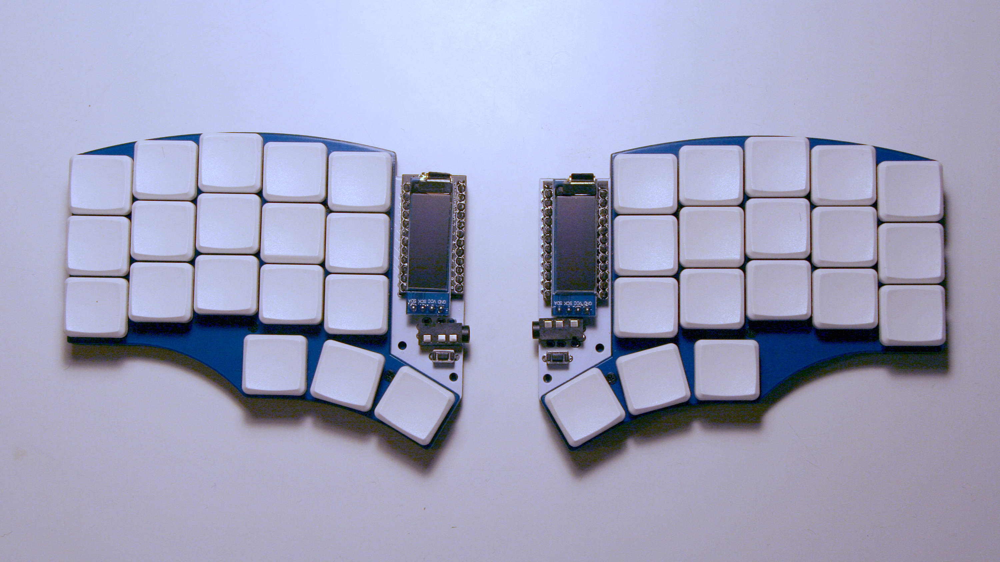
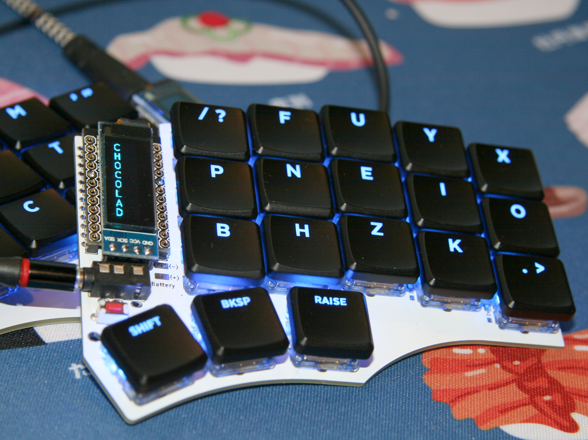

# Chocolad

The Chocolad is a WIP 3x5+3 split column stagger keyboard based on the [Corne Chocolate](https://github.com/foostan/crkbd/blob/master/corne-chocolate/doc/buildguide_en.md) and the [chocorne](https://github.com/davidphilipbarr/36keys/tree/master/42Keys/chocorne).

